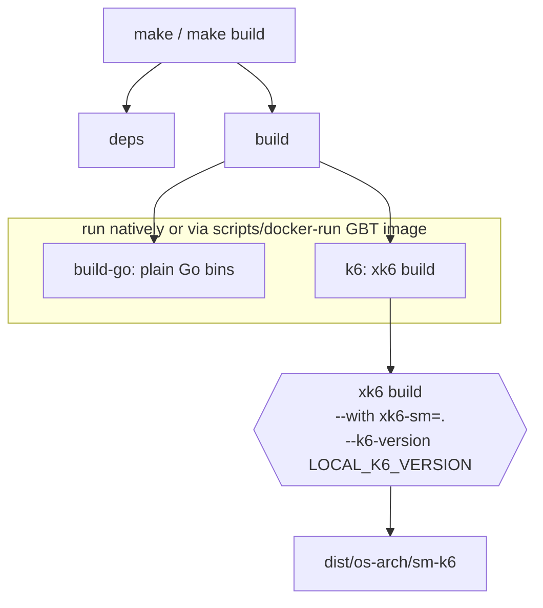

# Build & Packaging

## Overview

This component is the machinery that turns the two extensions in this repo into
a single distributable k6 binary called `sm-k6`, and the surrounding lint,
test, and release tooling. It is not part of the runtime — it's how the runtime
is produced.

The central act is an [`xk6`](https://github.com/grafana/xk6) build: xk6
compiles a fresh k6 binary with `github.com/grafana/xk6-sm/v2` linked in, so
the `sm` output and `grafanasecrets` secret source (registered via their
`init()` functions) are available to `k6 run`. The build is cross-platform (the
agent ships Linux amd64/arm/arm64 and darwin arm64), reproducible-ish via
`-trimpath`, and runs either directly or inside the Grafana Build Tools (GBT)
Docker image so contributors don't need the toolchain installed locally.

The build system is a self-documented Makefile that includes a numbered set of
fragments under `scripts/make/`. Two small internal packages support it:
`internal/version` (reads version/commit from Go build info at runtime) and
`internal/ruleguard` (a custom lint rule). Both are folded into this component
because they only exist to serve the build/lint pipeline.

## Responsibilities & boundaries

**Owns:**

- Building `sm-k6` via xk6 (`scripts/make/310_k6.mk`).
- Building plain Go binaries and injecting version info
  (`scripts/make/300_build.mk`).
- Running tests and lint, in Docker or natively (`400_testing.mk`,
  `500_linters.mk`, plus proto/workflow lint fragments).
- Release artifact production (driven by release-please + CI; see CI workflows
  and `scripts/release-binaries`).
- Exposing build metadata at runtime (`internal/version`).
- A custom lint rule (`internal/ruleguard`).

**Does NOT own:** any runtime behavior of the extensions — see [SM Metrics
Output](sm-metrics-output.md) and [Grafana Secrets
Source](grafana-secrets-source.md). It also does not own the integration tests'
logic, only the `test` targets that invoke them ([Integration
Testing](integration-testing.md)).

**Inputs:** the Go source, `PLATFORMS`, the pinned k6 and GBT versions.

**Outputs:** binaries under `dist/<os>-<arch>/sm-k6` (and a copy of the native
build at `dist/sm-k6`).

## Key code map

| Concern                        | Location                                                                                                                                   |
|--------------------------------|--------------------------------------------------------------------------------------------------------------------------------------------|
| Top-level entry / `all` target | `Makefile` (includes `.gbt.mk`, `config.mk`, `scripts/make/[0-9][0-9][0-9]_*.mk`)                                                          |
| Platforms & local k6 version   | `config.mk` — `PLATFORMS`, `LOCAL_K6_VERSION`                                                                                              |
| GBT Docker image pin           | `.gbt.mk` — `GBT_IMAGE`; runner `scripts/docker-run`                                                                                       |
| Build vars (dist dir, version) | `scripts/make/000_vars.mk` — `DISTDIR`, `BUILD_VERSION`                                                                                    |
| xk6 build of `sm-k6`           | `scripts/make/310_k6.mk` — `build-k6-*`, `k6`, `build-native` targets                                                                      |
| Plain Go binary build          | `scripts/make/300_build.mk` — `build_go_command`, `-ldflags -X .../version.version`                                                        |
| Test targets                   | `scripts/make/400_testing.mk` — `test`, `test-go`, `TEST_SHORT`                                                                            |
| Lint targets                   | `scripts/make/500_linters.mk` (+ `510_lint_proto.mk`, `520_lint_workflows.mk`)                                                             |
| Codegen                        | `scripts/make/600_generate.mk`, `610_generate_proto.mk`, `620_generate_policy_bot_config.mk`                                               |
| Runtime version info           | `internal/version/version.go` — `Short`, `Commit`, `Buildstamp`                                                                            |
| Custom lint rule               | `internal/ruleguard/rules.go` — `noContextTODO` (build tag `ruleguard`)                                                                    |
| golangci config                | `.golangci.yaml`                                                                                                                           |
| Helper scripts                 | `scripts/` — `version`, `release-binaries`, `validate-workflows`, `list-proto`, `list-sh-scripts`, `enforce-clean`, `report-test-coverage` |

## Architecture

The Makefile is intentionally thin: `make` runs `all → deps build`, and `build`
is extended by both the Go fragment and the k6 fragment. The numbered fragments
under `scripts/make/` are included in order, each adding targets to a category.

Two execution modes run throughout: in CI (`CI=true`) tools like `xk6`,
`gotestsum`, `golangci-lint`, and `shellcheck` are expected on `PATH`;
otherwise the Makefile wraps each in `./scripts/docker-run`, which `docker
run`s the pinned `GBT_IMAGE` with the repo, Go caches, and the Docker socket
mounted. `scripts/docker-run` is written to be valid as both Make include and
shell, and sources `.gbt.mk` to learn the image tag.

The xk6 invocation (`310_k6.mk`) is the load-bearing line: `xk6 build --with
github.com/grafana/xk6-sm/v2=. --k6-version $(LOCAL_K6_VERSION) --output
dist/<os>-<arch>/sm-k6 --build-flags '-trimpath'`. `LOCAL_K6_VERSION` is
derived from the `go.mod` requirement (`config.mk`), so the bundled k6 and the
k6 packages the extensions compile against stay in lockstep.

## Protocols & interfaces

- **CLI/Make contract:** `make` / `make build` (all platforms), `make
  build-native` (host only), `make test` (add `TEST_SHORT=false` for
  integration tests), `make lint` / `lint-go` / `lint-sh`. `make help`
  documents targets.
- **xk6 CLI:** `xk6 build` with the flags above.
- **Version injection:** plain Go builds pass `-ldflags '-X
  <version-pkg>.version=$(BUILD_VERSION)'`; at runtime `internal/version`
  instead reads `vcs.revision`/`vcs.time` from `debug.ReadBuildInfo()`.

## Network boundaries

Not applicable to the produced artifact. The build process itself pulls the GBT
Docker image and Go modules from the network and (in `docker-run`) mounts the
Docker socket; those are build-host concerns, not a runtime boundary.

## External dependencies

- **xk6** — builds the custom k6 binary.
- **Grafana Build Tools image** (`ghcr.io/grafana/grafana-build-tools`, pinned
  in `.gbt.mk`) — provides xk6, gotestsum, golangci-lint, shellcheck, protoc,
  etc. for hermetic builds.
- **Docker** — required to use the GBT image via `scripts/docker-run` (and for
  integration tests).
- **gotestsum / golangci-lint / shellcheck** — test runner and linters.
- **go-ruleguard** (`github.com/quasilyte/go-ruleguard/dsl`) — DSL for the
  custom rule in `internal/ruleguard`.
- **release-please + GitHub Actions** — release orchestration (see `.github/`
  and `CHANGELOG.md`).

## OS-specific dependencies

This component explicitly _produces_ per-OS/arch artifacts: `PLATFORMS` in
`config.mk`/`000_vars.mk` enumerates `linux/amd64`, `linux/arm`, `linux/arm64`,
`darwin/arm64` plus the host. The xk6 and Go build targets are templated per
platform via `GOOS`/`GOARCH`. The runtime code itself is platform-agnostic.
`scripts/docker-run` assumes a Unix host with a Docker socket.

## Security considerations

- **Supply chain:** the GBT image and k6 version are pinned (the GBT image by
  tag; k6 by `go.mod`), and `-trimpath` is used. `scripts/docker-run` mounts
  the Docker socket into the build container — a privileged operation worth
  noting for anyone hardening CI.
- **Release integrity:** artifacts are built and attached to GitHub releases by
  CI on release-please merges; `scripts/enforce-clean` guards against dirty
  trees. No signing is configured in this repo as of this writing.
- The build injects no secrets into binaries.

## Observability

Build/test/lint output is the observability surface: `gotestsum` writes
`dist/test.{json,xml}` and a coverage profile consumed by
`scripts/report-test-coverage`. At runtime, `internal/version` exposes the
embedded version/commit/buildstamp so a running `sm-k6` can report what it is.

## Testing strategy

- `internal/version` has unit tests (`version_test.go`).
- The build itself is exercised by CI workflows in `.github/workflows` and by
  `make build` / `make test`; `make test TEST_SHORT=false` additionally builds
  `build-native` and runs the integration suite.
- `scripts/validate-workflows` and the proto/workflow lint fragments keep CI
  config honest.
- Gap: there is no dedicated test that the produced `sm-k6` registers both
  extensions beyond what the integration suite implicitly covers.

## When to update

- When `PLATFORMS` changes (a target OS/arch added or dropped), update
  OS-specific dependencies and the platform list.
- When the xk6 invocation in `scripts/make/310_k6.mk` changes (flags, module
  path, how `--k6-version` is derived), update Architecture and Protocols.
- When the GBT image pin in `.gbt.mk` or the `docker-run` mounting changes,
  update External dependencies and Security considerations.
- When a make fragment is added/removed under `scripts/make/`, or a new helper
  script is added under `scripts/`, update the key code map.
- When `internal/version` or `internal/ruleguard` grows beyond a helper (e.g.
  more rules, exposed via an endpoint), reconsider splitting it into its own
  doc.
- The `source_paths` above are what Validate mode watches; keep them accurate
  and bump `last_reviewed_commit` to the reviewed sha after any review or
  update.
