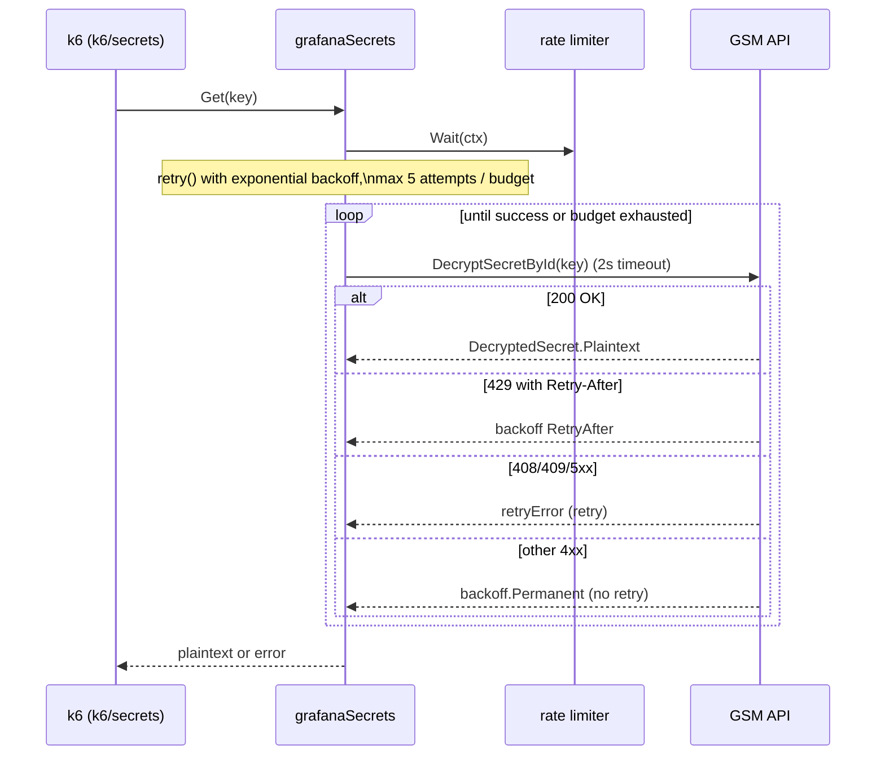

# Grafana Secrets Source

## Overview

The Grafana Secrets Source is a [k6 secret source
extension](https://grafana.com/docs/k6/latest/using-k6/secret-source/)
registered under the name `grafanasecrets`. When a check script reads a secret
(via k6's `k6/secrets` module), k6 delegates the lookup to this extension,
which resolves the key against the Grafana Secrets Manager (GSM) HTTP API and
returns the plaintext.

It exists because Synthetic Monitoring scripts must not embed credentials;
instead they reference secrets by key, and this extension fetches them at run
time using a bearer token configured by the agent. The extension is the only
part of `xk6-sm` that makes outbound network calls, so it carries the network,
retry, and rate-limiting logic for talking to GSM.

The thin root file `secrets.go` only registers the extension; all behavior
lives in the `internal/secrets` package. The component is configured by a JSON
file whose path is passed on the k6 command line
(`--secret-source=grafanasecrets=config=<file>`).

## Responsibilities & boundaries

**Owns:**

- Parsing and validating the JSON config (URL, token, optional rate-limit
  knobs) — `getConfig`, `parseConfigArgument`.
- Constructing the GSM API client and resolving keys — `grafanaSecrets.Get`,
  `grafanaSecrets.get`.
- Client-side rate limiting (token bucket) — `newLimiter`, the `limiter`
  interface.
- Retry/backoff policy, including honoring HTTP `Retry-After` — `retry`,
  `parseRetryAfter`, `retryError`.

**Does NOT own:**

- Storing or encrypting secrets — GSM does that; this component only requests
  decryption of an existing secret by id.
- Where the script uses the secret — that's the script and k6's `k6/secrets`
  module.
- Metric output — see [SM Metrics Output](sm-metrics-output.md).

**Inputs:** `secretsource.Params` (the `config=<path>` argument and a logger),
plus secret keys requested by k6 at run time.

**Output:** the plaintext secret string, or an error.

## Key code map

| Concern                        | Location                                                                                                         |
|--------------------------------|------------------------------------------------------------------------------------------------------------------|
| Extension registration         | `secrets.go` — `init()` calling `secretsource.RegisterExtension("grafanasecrets", secrets.EntryPoint)`           |
| Constructor / wiring           | `internal/secrets/secret.go` — `EntryPoint(params secretsource.Params)`                                          |
| Secret source interface        | `internal/secrets/secret.go` — `grafanaSecrets` (`Name`, `Description`, `Get`)                                   |
| Single fetch + status handling | `internal/secrets/secret.go` — `grafanaSecrets.get`                                                              |
| Retry loop                     | `internal/secrets/secret.go` — `retry`, `maxAttempts`/`baseInterval`/`maxInterval`/`maxElapsedTime` consts       |
| Retry-After parsing            | `internal/secrets/secret.go` — `parseRetryAfter`, `retryError`                                                   |
| Rate limiter                   | `internal/secrets/secret.go` — `limiter` interface, `newLimiter`                                                 |
| Config parsing/validation      | `internal/secrets/secret.go` — `getConfig`, `parseConfigArgument`, `extConfig`                                   |
| Errors                         | `internal/secrets/secret.go` — `errInvalidConfig`, `errMissingURL`, `errMissingToken`, `errTooManyRetries`, etc. |

## Architecture

`EntryPoint` reads and validates the config, builds a `gsm-api-go-client`
configured with bearer auth, and returns a `grafanaSecrets` value holding the
client, a rate limiter, and the logger. Each `Get(key)` call first blocks on
the rate limiter, then runs a single fetch closure (`get`) inside the retry
loop.

Retry classification in `get` is the heart of the component:

- **200** — decode `DecryptedSecret`, return `Plaintext`. A decode failure is
  `backoff.Permanent` (not retried).
- **429** — if a `Retry-After` header is present and parseable, surface it as a
  `backoff.RetryAfterError` so the backoff library waits the requested time;
  otherwise fall through to the generic retriable path.
- **408, 409, 500, 502, 503, 504** — wrapped in `retryError{status}` and
  retried.
- **anything else** — `backoff.Permanent`, returned immediately.

`Get` then maps the terminal error: exhausted retries (`retryError`) become
`errTooManyRetries` with the last status; a `Retry-After` that exceeds the
total budget becomes `errTooManyRetries`; other errors pass through. The retry
schedule (`retry`) uses `backoff.ExponentialBackOff` with `maxAttempts` tries
and a `maxElapsedTime` of `maxAttempts * requestTimeout`.

## Protocols & interfaces

- **k6 secret source API** (`go.k6.io/k6/v2/secretsource`): implements
  `secretsource.Source`; registered via `secretsource.RegisterExtension`.
- **CLI contract:** `--secret-source=grafanasecrets=config=<filename>`. The
  `config=` prefix is mandatory (`parseConfigArgument` → `errInvalidConfig`).
- **Config file (JSON):** `extConfig` — `url` (required), `token` (required,
  bearer), `requestsPerMinuteLimit` (optional, default 300), `requestsBurst`
  (optional, default 10). See `examples/secrets.json` and
  `examples/secrets.js`.
- **GSM API (outbound HTTP):** via `github.com/grafana/gsm-api-go-client`; the
  single call used is `DecryptSecretById(ctx, key)`. Honors RFC 7231 §7.1.3
  `Retry-After` (integer seconds or HTTP-date) on 429.

## Network boundaries

This is the one component that crosses a network boundary. It **dials out**
over HTTPS to the GSM API at the configured `url`, authenticating with a bearer
token. It listens on no ports and accepts no inbound connections. Each request
is bounded by a 2-second `requestTimeout` (`context.WithTimeout` in `get`), and
the overall key resolution is bounded by the retry budget. The trust boundary
is the GSM API endpoint; the token is the credential that crosses it.

## External dependencies

- **Grafana Secrets Manager API** (infrastructure) — the remote service that
  decrypts and returns secrets. Reached through
  `github.com/grafana/gsm-api-go-client`, constructed in `EntryPoint` with
  `gsmClient.WithBearerAuth(config.Token)`.
- `github.com/cenkalti/backoff/v5` — exponential backoff and `Retry-After`
  handling (`backoff.Retry`, `RetryAfter`, `RetryAfterError`, `Permanent`).
- `golang.org/x/time/rate` — token-bucket rate limiter returned by `newLimiter`.
- `github.com/sirupsen/logrus` — structured logging.

## OS-specific dependencies

Not applicable — no build tags or platform-specific code. Standard `net/http`
and the GSM client work identically across platforms.

## Security considerations

This is the security-sensitive component of the repo:

- **Credential handling:** the bearer `token` is read from the JSON config file
  (`getConfig`) and handed to the GSM client. It is required
  (`errMissingToken`) and is never logged — log fields are limited to the
  secret `key`, attempt count, and status. Operators must protect the config
  file's contents.
- **Secret material:** plaintext secrets are returned to k6 and never logged by
  this component; only "secret retrieved" plus the key is logged on success.
- **Transport:** authentication relies on the `url` being an HTTPS endpoint;
  TLS is handled by the GSM client / `net/http` defaults (no custom TLS config,
  no `InsecureSkipVerify`).
- **Abuse protection:** the client-side rate limiter (default 300/min, burst
  10) exists primarily to protect the GSM API from a buggy script requesting
  secrets in a loop — see the rationale comment near
  `defaultRequestsPerMinuteLimit`.
- **Input validation:** config is validated in `getConfig`; positive rate-limit
  values are enforced (`errInvalidRequestsPerMinuteLimit`,
  `errInvalidRequestsBurst`).

## Observability

- **Logs:** the k6-supplied `logrus` logger, tagged per call with `key` and,
  after resolution, `attempts`. Levels: `Debug` "Getting secret", `Info`
  "secret retrieved", `Warn` for retriable statuses and "Retry-After exceeds
  retry budget", `Error` for "too many retries" and unhandled errors. The
  `attempts` counter (incremented in the `get` closure) is the key signal for
  diagnosing flaky GSM behavior.
- **Metrics/traces:** none exported by this component.

## Testing strategy

- **Unit tests:** `internal/secrets/secret_test.go` (run via `make test` or `go
  test ./internal/secrets/...`). Given the retry/status matrix in `get` and the
  `Retry-After` parsing in `parseRetryAfter`, these are the highest-value tests
  — verify each status class (200/429/5xx/other) and the budget-exhaustion
  paths.
- **End-to-end:** secret resolution is also exercised through the integration
  suite when a script reads secrets; see [Integration
  Testing](integration-testing.md) and `examples/secrets.js`.
- **Gaps:** note honestly whether `parseRetryAfter`'s HTTP-date branch and the
  rate-limiter interaction under load are covered, as these are easy to
  regress.

## When to update

- When the retry policy changes — new retriable/permanent status codes in
  `get`, different `maxAttempts`/timeouts/backoff constants — update the
  Architecture status list and the sequence diagram.
- When the config schema (`extConfig`) gains or loses a field, update Protocols
  & interfaces and Security considerations.
- When the GSM client call changes (something other than `DecryptSecretById`,
  or a new endpoint), update Protocols and the key code map.
- When rate-limiter defaults or behavior change, update Security
  considerations.
- The `source_paths` above are what Validate mode watches; keep them accurate
  and bump `last_reviewed_commit` to the reviewed sha after any review or
  update.
