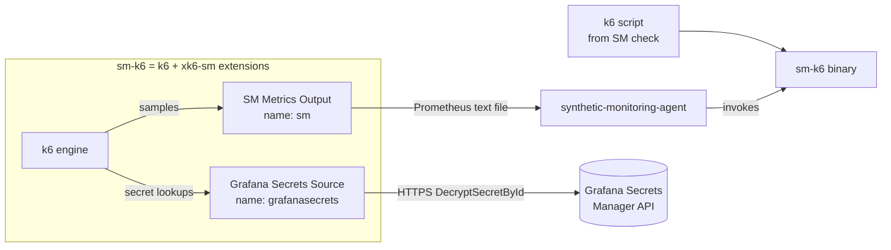

# xk6-sm — Architecture

## What this is

`xk6-sm` is a bundle of two [k6](https://k6.io) extensions used by the Grafana
[synthetic-monitoring-agent](https://github.com/grafana/synthetic-monitoring-agent)
(SM). The agent runs user-authored k6 scripts as synthetic-monitoring checks
and needs k6 to (a) emit results in the metric shape SM expects and (b) resolve
secrets referenced by scripts from Grafana's secret store. Those two needs map
to the two extensions in this repo:

- an **output** extension, registered under the name `sm`, that aggregates k6's
  metric samples in constant memory and writes them out as Prometheus text
  exposition format with SM-specific renaming and label handling; and
- a **secret source** extension, registered under the name `grafanasecrets`,
  that resolves `k6/secrets` lookups against the Grafana Secrets Manager (GSM)
  HTTP API.

Both extensions are compiled into a single custom k6 binary called `sm-k6`
using [`xk6`](https://github.com/grafana/xk6). End users of Synthetic
Monitoring never build this themselves — the agent ships a prebuilt `sm-k6`.

## System context

## Components

| Component              | Responsibility                                                                                    | Doc                                                    |
|------------------------|---------------------------------------------------------------------------------------------------|--------------------------------------------------------|
| SM Metrics Output      | k6 `output.Output` that aggregates samples and writes SM-shaped Prometheus text                   | [sm-metrics-output.md](sm-metrics-output.md)           |
| Grafana Secrets Source | k6 `secretsource.Source` that fetches secrets from the GSM API with rate limiting and retries     | [grafana-secrets-source.md](grafana-secrets-source.md) |
| Build & Packaging      | Compiling both extensions into the `sm-k6` binary via xk6; build/lint/release tooling             | [build-and-packaging.md](build-and-packaging.md)       |
| Integration Testing    | End-to-end tests that run the compiled `sm-k6` against real scripts and assert on emitted metrics | [integration-testing.md](integration-testing.md)       |

## Cross-cutting concerns

- **k6 extension model.** Both runtime components are k6 plugins registered via
  `init()` (`output.RegisterExtension` in `output.go`,
  `secretsource.RegisterExtension` in `secrets.go`). They implement interfaces
  defined by `go.k6.io/k6/v2` and are driven entirely by the k6 engine —
  neither is a standalone process. Their lifecycles, configuration, and
  threading model are dictated by k6.
- **Configuration.** Each extension takes a single `ConfigArgument` string from
  the k6 command line: the output takes an output filename (`-o sm=<file>`),
  the secret source takes `config=<path>` pointing at a JSON file. The output
  also reads the `SM_K6_BROWSER_RESOURCE_TYPES` environment variable. There is
  no shared config layer.
- **Logging.** Both use `logrus` field loggers supplied by k6's `Params`. The
  output additionally creates an internal discard logger inside `metricStore`.
  There are no metrics-about-metrics or traces exported by this repo itself —
  see each component's Observability section.
- **Packaging & versioning.** Everything is delivered as the single `sm-k6`
  binary; see [Build & Packaging](build-and-packaging.md). Version/commit info
  is read from Go build info via `internal/version`.

## How to navigate these docs

- Understanding or changing how SM metrics are named/derived/dropped → start
  with [SM Metrics Output](sm-metrics-output.md), specifically `DeriveMetrics`,
  `RemoveMetrics`, and `RemoveLabels` in `output.go`.
- Debugging secret resolution or GSM API behavior (retries, rate limiting) →
  [Grafana Secrets Source](grafana-secrets-source.md).
- Building `sm-k6`, bumping the k6 version, or release mechanics → [Build &
  Packaging](build-and-packaging.md).
- Reproducing a metric-shape regression end to end → [Integration
  Testing](integration-testing.md).

## When to update

- When a third k6 extension is added (a new `RegisterExtension` call), add a
  component doc and a row to the Components table and the system diagram.
- When the boundary between the agent and `sm-k6` changes (e.g. a new output
  target, or secrets stop flowing through this binary), update the system
  context diagram.
- When a component is renamed, merged, or removed, reconcile the table, the
  diagram, and the cross-cutting notes.
- Run this skill's Validate mode periodically; the `source_paths` in each doc's
  frontmatter are what it watches. Bump `last_reviewed_commit` to the reviewed
  sha after any review or update.
