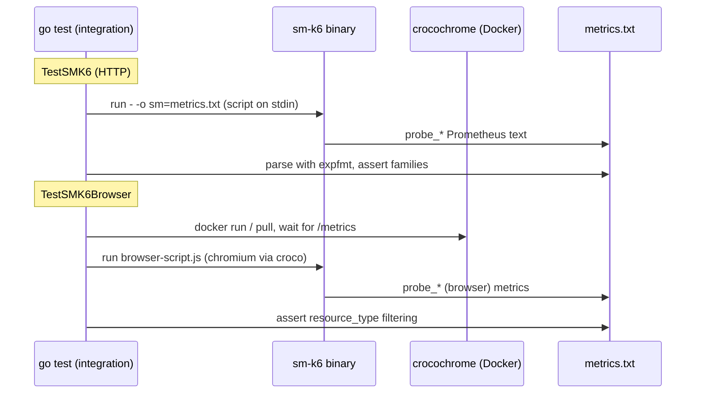

# Integration Testing

## Overview

The integration suite is the end-to-end safety net for the SM metric contract.
Unit tests can check helpers in isolation, but the thing that actually matters
— "when a real script runs through the real `sm-k6` binary, does the output
file contain exactly the `probe_*` metrics SM expects, with the right labels
and values?" — can only be verified by running the compiled binary. That's what
this component does.

The tests live in `package integration_test` under `integration/`. They shell
out to the prebuilt `sm-k6` binary (from `dist/`, or `TEST_SMK6`), feed it a k6
script on stdin, capture the `sm` output file, parse it as Prometheus text, and
assert over the resulting metric families. A second axis covers k6's browser
module, which requires a real Chromium; that is provided by running the
[crocochrome](https://github.com/grafana/crocochrome) container via Docker.

Because these tests need a compiled binary and (for browser) Docker, they are
gated behind `-short`: `make test` skips them by default; `make test
TEST_SHORT=false` builds `build-native` first and runs them.

## Responsibilities & boundaries

**Owns:** black-box verification of the assembled `sm-k6` binary — the presence
and absence of specific metrics, presence/absence of labels, metric values, the
`probe_` prefix, and browser `resource_type` filtering behavior.

**Does NOT own:** the logic under test (that's [SM Metrics
Output](sm-metrics-output.md) and [Grafana Secrets
Source](grafana-secrets-source.md)) or building the binary (that's [Build &
Packaging](build-and-packaging.md) — this suite only consumes the artifact).

**Inputs:** the `sm-k6` binary, the k6 scripts in `integration/`, and (for
browser) the crocochrome image.

**Output:** pass/fail assertions over parsed metric families.

## Key code map

| Concern                       | Location                                                                                                               |
|-------------------------------|------------------------------------------------------------------------------------------------------------------------|
| HTTP-script test driver       | `integration/integration_test.go` — `runScript` (runs `sm-k6 run -` with `-o sm=...`)                                  |
| Main HTTP test                | `integration/integration_test.go` — `TestSMK6`                                                                         |
| Browser test                  | `integration/integration_test.go` — `TestSMK6Browser`                                                                  |
| Value assertion helpers       | `integration/integration_test.go` — `equals`, `nonZero`, `anyValue`                                                    |
| Browser harness / crocochrome | `integration/integration_browserutils_test.go` — `runCrocochrome`, `runBrowserScript`, `createSession`/`deleteSession` |
| Test scripts                  | `integration/test-script.js`, `integration/browser-script.js`                                                          |
| Test targets / gating         | `scripts/make/400_testing.mk` — `test`, `test-go`, `TEST_SHORT`, `EXTRA_TEST_DEPS`                                     |

## Architecture

`runScript` locates the binary (`TEST_SMK6` or `dist/<os>-<arch>/sm-k6`), fails
fast if it isn't built, then runs `sm-k6 run - --summary-mode=disabled
--address= -o sm=<tmp>/metrics.txt -o json=<tmp>/metrics.json` with the script
on stdin, and parses the `sm` file with `expfmt` into `[]*dto.MetricFamily` for
the subtests to assert over.

`TestSMK6` is organized as subtests asserting orthogonal properties: _wanted
metrics are present_, _unwanted metrics are not present_, _labels are
present/absent_, _metrics have expected values_ (a table of metric → value
predicate using `equals`/`nonZero`/`anyValue`), and _metrics have required
prefix_ (`probe_`). `TestSMK6Browser` runs the browser script against
crocochrome under three `SM_K6_BROWSER_RESOURCE_TYPES` configurations (default,
a custom allowlist, and `*`) and checks the document-only filtering and that
the timeseries count stays sane.

The crocochrome harness in `integration_browserutils_test.go` pulls a pinned
image, and adapts to CI: locally it maps port 8080, while in CI (`CI=true`) it
joins the job container's network namespace (`--network=container:<hostname>`)
since port mapping isn't available there.

## Protocols & interfaces

- **Process/CLI:** drives `sm-k6` exactly as the agent would, via `os/exec`
  with stdin scripts and `-o sm=`/`-o json=` outputs.
- **Prometheus text:** consumes the output with
  `github.com/prometheus/common/expfmt` into
  `github.com/prometheus/client_model/go` types — the same contract SM scrapes.
- **crocochrome HTTP API:** `runCrocochrome` polls
  `http://localhost:8080/metrics` for readiness;
  `createSession`/`deleteSession` exercise its session endpoints.

## Network boundaries

The suite itself makes network calls: the HTTP test script targets a real host
(`TEST_HOST`, default `quickpizza.grafana.com`), and the browser test talks to
the local crocochrome container over HTTP (port 8080, or shared netns in CI).
These are test-harness boundaries, not product boundaries.

## External dependencies

- **A compiled `sm-k6` binary** — hard prerequisite; the test fails fast if
  it's absent.
- **Docker** — required for the browser tests (to run crocochrome).
- **crocochrome image** (`ghcr.io/grafana/crocochrome`, pinned by digest in
  `runCrocochrome`) — supplies Chromium for `k6/browser`.
- **A reachable HTTP target** (`quickpizza.grafana.com` by default) for the
  HTTP script.
- `prometheus/common` + `prometheus/client_model` — parsing/asserting metrics.

## OS-specific dependencies

`runScript` selects the binary by `runtime.GOOS`/`runtime.GOARCH`. The browser
harness assumes Docker is present and branches on `CI` for networking. No
build-tag-level OS specialization in the test code itself.

## Security considerations

Test-only code. It executes a local binary and starts a container; it makes
outbound requests to a public test endpoint. No credentials are involved unless
a secrets-using script is run. The crocochrome image is pinned by digest, which
mitigates image-tag tampering.

## Observability

Failures surface through `go test` / `gotestsum` output (`make test`), with the
JSON/JUnit/coverage artifacts written under `dist/` by the test target. The
tests log binary/container lifecycle via `t.Logf`.

## Testing strategy

This _is_ the testing component. To run it: `make test TEST_SHORT=false`
(builds `build-native` then runs everything), or directly `go test
./integration/...` against an already-built binary (set `TEST_SMK6` to point at
it). The browser subtests need Docker; without it they fail rather than skip.
Honest gap: assertions encode the expected SM metric set inline, so they must
be kept in step with changes to `DeriveMetrics`/`RemoveMetrics` in the output
component.

## When to update

- When the SM metric contract changes (metrics added/renamed/dropped in [SM
  Metrics Output](sm-metrics-output.md)), update the corresponding
  present/absent/value assertions in `TestSMK6` and note it here.
- When browser `resource_type` filtering or `SM_K6_BROWSER_RESOURCE_TYPES`
  behavior changes, update `TestSMK6Browser` and the Architecture section.
- When the crocochrome image is bumped or its API changes, update External
  dependencies and `runCrocochrome`.
- When the test gating (`TEST_SHORT`, `EXTRA_TEST_DEPS`) or how the binary is
  located (`TEST_SMK6`) changes, update Testing strategy.
- The `source_paths` above are what Validate mode watches; keep them accurate
  and bump `last_reviewed_commit` to the reviewed sha after any review or
  update.
