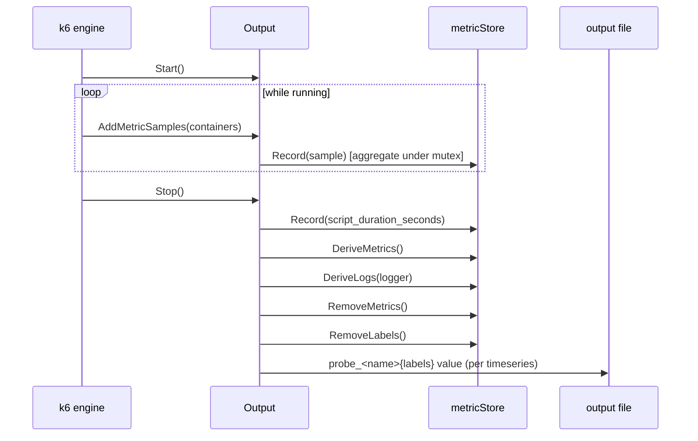

# SM Metrics Output

## Overview

The SM Metrics Output is a [k6 output
extension](https://grafana.com/docs/k6/latest/extensions/) registered under the
name `sm`. Its job is to take the stream of metric samples k6 produces while
running a check script and turn them into a single Prometheus text-exposition
file shaped the way Synthetic Monitoring expects. The
synthetic-monitoring-agent then reads that file.

It solves two problems specific to SM. First, SM only cares about _one_
datapoint per timeseries per run, so the output aggregates all samples for a
given timeseries into a single value as they arrive — counters are summed,
trends/rates are averaged, gauges take the latest — keeping memory constant
regardless of how many samples k6 emits. Second, k6's native metric names,
units, and labels don't match the long-standing SM metric contract, so once the
run finishes the output performs a post-processing pass that derives new
metrics, renames others, converts milliseconds to seconds, and strips
high-cardinality or redundant labels.

The component is a pure in-process k6 plugin: it opens no sockets and runs no
goroutines of its own. Its only side effect is writing the output file passed
on the k6 command line (`-o sm=<filename>`).

## Responsibilities & boundaries

**Owns:**

- Aggregating k6 samples into one value per timeseries (`metricStore.Record`).
- The SM metric contract: which metrics exist, their names, units, and labels
  (`DeriveMetrics`, `RemoveMetrics`, `RemoveLabels`, `DeriveLogs`).
- Marshalling the final timeseries to Prometheus text exposition format,
  including the `probe_` name prefix and label-name sanitization
  (`marshalPrometheus`, `sanitizeLabelName`).

**Does NOT own:**

- Running the script or producing the raw samples — that is k6 itself.
- Secret resolution — see [Grafana Secrets Source](grafana-secrets-source.md).
- Delivery/scraping of the resulting file — that is the
  synthetic-monitoring-agent's job. This component only writes a local file.

**Inputs:** `output.Params` (the output filename via `ConfigArgument`, an afero
filesystem, a logger) and a stream of `[]metrics.SampleContainer` pushed by the
k6 engine.

**Output:** lines of the form `probe_<name>{<labels>} <value>` written to the
configured file.

## Key code map

| Concern                    | Location                                                                                     |
|----------------------------|----------------------------------------------------------------------------------------------|
| Extension registration     | `output.go` — `init()` calling `output.RegisterExtension(ExtensionName, New)`                |
| Constructor / wiring       | `output.go` — `New(params output.Params)`                                                    |
| k6 Output interface        | `output.go` — `Output.Description`, `Output.Start`, `Output.AddMetricSamples`, `Output.Stop` |
| Sample aggregation         | `output.go` — `metricStore.Record`, types `timeseries` and `value`                           |
| Metric derivation/renaming | `output.go` — `metricStore.DeriveMetrics`                                                    |
| Log derivation from checks | `output.go` — `metricStore.DeriveLogs`                                                       |
| Metric removal             | `output.go` — `metricStore.RemoveMetrics` (incl. `resource_type` allowlist)                  |
| Label removal/rewriting    | `output.go` — `metricStore.RemoveLabels`                                                     |
| Prometheus marshalling     | `output.go` — `marshalPrometheus`, `sanitizeLabelName`, `quotedEscaper`                      |
| Errors                     | `errors.go` — `errOutputFilenameRequired`                                                    |

## Architecture

Internally the component is the `Output` struct wrapping a `metricStore`. The
`metricStore` holds a `map[timeseries]value` guarded by a mutex. `timeseries`
is a trimmed-down version of k6's `metrics.TimeSeries` (name, type, and the
immutable `*metrics.TagSet`) so it can be used directly as a map key —
`timeseriesFromK6` preserves k6's equality guarantee.

The flow follows the k6 output lifecycle: `Start` records the start time;
`AddMetricSamples` is called repeatedly (and must be fast and non-blocking, per
k6) and simply forwards each sample to `metricStore.Record`, which aggregates
in place under the lock; `Stop` does all the heavy post-processing once, then
writes the file.

The ordering in `Stop` matters: derivation runs first (so new metrics like
`http_requests_total`, `http_info`, the `phase`-labelled
`http_duration_seconds`, `checks_total`, etc. exist), then removal prunes the
now-redundant originals listed in `RemoveMetrics`'s `deletable` map, and
finally `RemoveLabels` strips labels such as `error`, `error_code`,
`expected_response`, empty `group`, and rewrites `url` from `__raw_url__` when
present.

`DeriveMetrics` is intentionally 1:N only — one source timeseries can fan out
to several derived ones, but it cannot aggregate many into one (that's done
during `Record`). See the long comment on `metricStore` for the explicit
non-goals.

## Protocols & interfaces

- **k6 output extension API** (`go.k6.io/k6/v2/output`): the component
  implements `output.Output` and is registered via `output.RegisterExtension`.
  `New` matches the `output.New`-style signature k6 requires.
- **CLI contract:** invoked as `k6 run -o sm=<filename>`. A missing filename is
  a hard error (`errOutputFilenameRequired`).
- **Output format:** Prometheus text exposition format, one sample per line,
  every metric name prefixed with `probe_`. Quoting/escaping is deliberately
  hand-rolled (see `quotedEscaper` and the `#212` reference) rather than using
  the upstream Prometheus formatter.
- **Configuration env var:** `SM_K6_BROWSER_RESOURCE_TYPES` — comma-separated
  allowlist of `resource_type` tag values to keep (default `document`; `*`
  keeps everything; empty drops all browser resource metrics). Documented in
  the repo `README.md`.

## Network boundaries

Not applicable — the component is entirely in-process. It reads samples from
the k6 engine via function calls and writes to a local file created through the
afero filesystem in `params.FS` (`params.FS.Create(fn)` in `New`). It opens no
network sockets.

## External dependencies

Libraries only — no infrastructure:

- `go.k6.io/k6/v2/metrics` and `.../output` — the sample types and the output
  plugin interface this component implements.
- `github.com/mstoykov/atlas` — used to construct an empty `TagSet` for the
  synthetic `script_duration_seconds` sample added in `Stop`.
- `github.com/sirupsen/logrus` — structured logging (`logrus.FieldLogger`). The
  `metricStore`'s own logger is created in `newMetricStore` and defaults to
  discarding output until `New` replaces it with the k6-supplied logger.

## OS-specific dependencies

Not applicable — no build tags, per-OS files, or syscalls. The code is
platform-agnostic; only the surrounding build produces per-OS/arch binaries
(see [Build & Packaging](build-and-packaging.md)).

## Security considerations

Low surface area. The component does not handle credentials or authenticate to
anything. The main trust concern is output integrity: metric names and label
names/values originate from the script and the tags k6 attaches, and are
written into a Prometheus text file. `sanitizeLabelName` replaces invalid
characters in metric and label _names_ with `_`, and `quotedEscaper` escapes
`\`, newlines, and `"` in label _values_, preventing malformed or injected
lines in the exposition format. Label values are otherwise passed through
verbatim. The output file is created via the afero FS provided by k6 with
whatever path the operator passes on the command line.

## Observability

This component is observed through its own log output and the metrics it emits:

- **Logs:** uses the k6-supplied `logrus` logger tagged `output=sm` (`New`),
  and the internal store logger tagged `component=store`. Most per-metric
  tracing is at `Trace`/`Debug` level inside `DeriveMetrics`, `RemoveMetrics`,
  and `RemoveLabels`. `Start`/`Stop` log at `Debug` with run duration.
- **Derived logs:** `DeriveLogs` emits an `Info`-level "check result" log line
  per `checks` timeseries, carrying the check tags plus `value`, `count`, and
  `metric=checks_total`. These are a deliberate product output, not just
  diagnostics.
- **Self-metric:** `Stop` injects a `script_duration_seconds` gauge measuring
  total run wall-time, which then flows through the normal pipeline.

There are no traces and no `/metrics` endpoint — the component is a short-lived
plugin inside a `k6 run`.

## Testing strategy

- **Unit tests:** `output_test.go` covers the marshalling/sanitization helpers
  and store behavior at the package level (`package sm`). Run with `make test`
  (which runs `go test`), or `go test ./...`.
- **Benchmarks:** `remove_bench_test.go` benchmarks the label/metric removal
  path — relevant because `AddMetricSamples`/`Record` are on k6's hot path and
  the post-processing walks the whole store.
- **End-to-end:** the SM-shaped output is asserted against real `sm-k6` runs in
  the integration suite — see [Integration Testing](integration-testing.md),
  which parses the emitted Prometheus file and checks for the expected
  `probe_*` metrics.
- **Gaps:** the large `switch` in `DeriveMetrics` is the highest-risk area for
  regressions; coverage there is best exercised through the integration suite
  rather than focused unit tests.

## When to update

- When a new metric is derived, renamed, or dropped — i.e. any change to the
  `switch` in `DeriveMetrics`, the `deletable` map in `RemoveMetrics`, or the
  label handling in `RemoveLabels` — update the Architecture section and the
  list of derived metrics.
- When the aggregation rules in `Record` change (a new `metrics.MetricType`
  case, different averaging), update the Overview and Architecture.
- When the output format or `probe_` prefix changes, or quoting/sanitization in
  `marshalPrometheus`/`sanitizeLabelName` changes, update Protocols &
  interfaces and Security considerations.
- When a new configuration knob (env var or `ConfigArgument` form) is added,
  update Protocols & interfaces.
- The `source_paths` above are what Validate mode watches; keep them accurate
  and bump `last_reviewed_commit` to the reviewed sha after any review or
  update.
